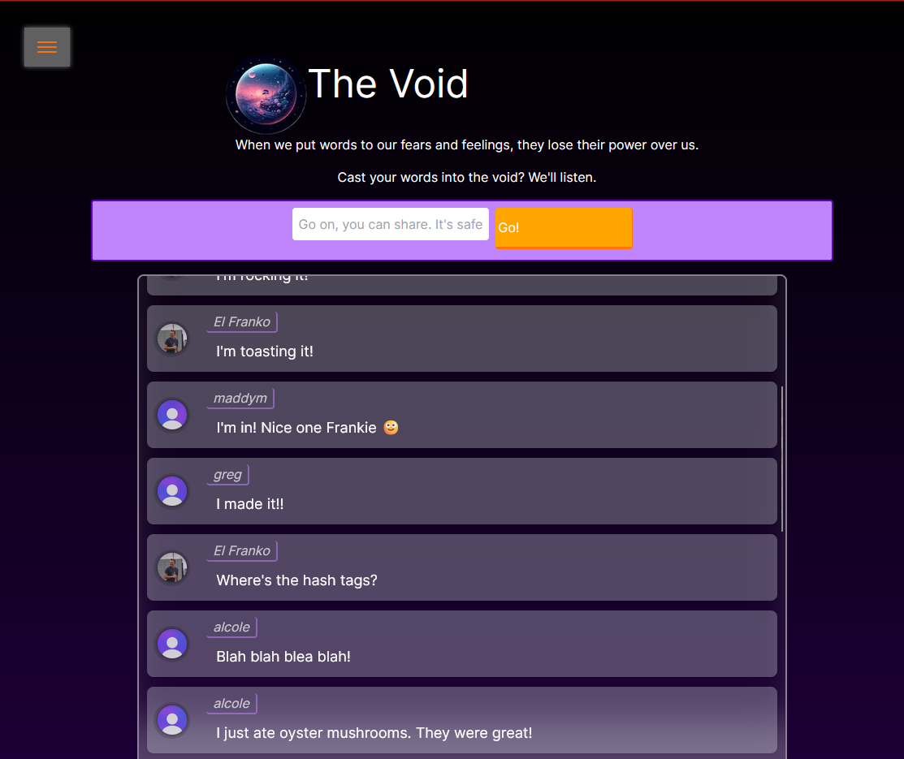
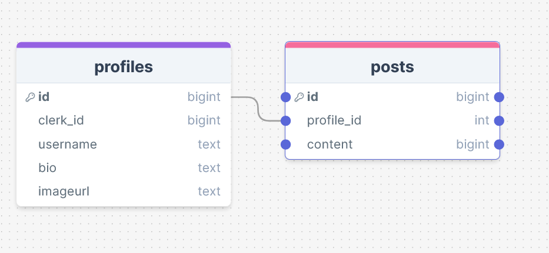

# Week Nine Project

## Project - Build a social network

**Link to project:** [Link](https://our-void.vercel.app/)

Continuing with Next.js and adding user authentication with the magic that is Clerk, we built a rudimentary 'social network' this week.

I chose to use Supabase for database hosting, with the site hosted on Vercel.

I kept track of my ideas, planning and progress here: [Planning](https://frankjs.notion.site/Day-Thirty-Nine-Project-24d3bd4839434c17bba360ad24613769?pvs=4)

I called it **The Void**, because when we post online in places like this, it's kind of where we are shouting into...

### Requirements & Deliverables

- Use Clerk.com to set up user signup and login.

- Use the Clerk userId to associate posts with a user.

- Enable each user to create a profile associated with their userId, and a form to input their biography and location data, etc. with a URL similar to /user/[userId].

- Enable users to create posts associated with the userId, and display those posts on the user's profile page

- Show a 404 error if a user profile doesn't exist

- Use at least 1 Radix UI Primitive or similar

**Stretch Goals**

- Enable users to visit other user profiles after seeing their posts on a global timeline

- Enable users to follow other users by creating a follower and follwee relationship between two user profiles

- Enable users to like other users' posts by creating a user_id and liked_post relationship in a junction table

- A user's biography cannot be blank. If a user logs in but doesn't have a biography set, they should be asked to fill one in

### User Stories

- As a user, I am able to sign up for an account and create a user profile
- As a user, I am able to log in and out of my account
- As a user, I am able to create posts on my profile timeline
- As a user, I am able to see all posts by all users on a global timeline

### Stretch Stories

- As a user, I am able to see a list of other user's posts and/or profiles on the site
- As a user, I am able able to visit other user profiles
- As a user, I am able to follow other users
- As a user, I am able to like posts I think are good, and see how many likes a post has

# The Outcome!

## Features!

- Scrollable user posts.
- User can sign up and sign in.
- User can see their profile page, edit their username and bio, and make posts from their page.
- Users can see other users who have signed up, then browse their profiles.
- Fancy hyperlinks!
- Radix components include: Avatar, Toast popup (on new post submission)

## What went well

### DrawSQL

DrawSQL to the rescue, as in previous weeks. What a great tool! Here was my very simple schema and goal for the project:

I adore Supabases' SQL Editor and used it again this week to construct my database, and make quicky checks and edits to what I needed.

### Components

All of the practice in prior weeks has given me a good understanding of how to make components, when and where to use them, and also I've just found them a joy!

I feel like I have got a good grasp on making my apps/websites modular which helps in keeping code clean and readable. I like being able to separate out pages themselves, from reusable components, and also away from reused server-side/database query code.

### Functionality

Once again I'm quite happy with how the site worked out this week.

It was a bit of a personal stretch to implement the hamburger menu, but some Googling, following and modifying examples realy helped.
I'm not 100% happy with the implemenetation of it, but I think it works well in this scenario.

I'm pleased with the sites consistency. I think the similarities between hyour own user page, and the page of others is a nice touch - with just enough differentiation to know that it's your own page.

Integrating the `LDRS` [loading animation library](https://uiball.com/ldrs/) was easy enough _(fantastic website and docs!)_ and I feel adds a nice bit of polish to the site when navigating between pages.

### User Interface and Design

I really enjoying blending Tailwind with standard CSS in this project. I love the absolute utility of Tailwind and the ability it gives to layout a site and a page in a speedy fashion.

I don't find it "the one tool to rule them all" though - I still prefer to make separate classes in CSS for specific things, such as the `.fancy-link` classes I made for the hyperlinks over the site.

And I _really_ had fun making those `.fancy-links`!

**Radix Primitives**

I used a couple of [Radix components](https://www.radix-ui.com/primitives); Avatars and Toast popups. These two I found quite simple to reverse engineer and implement.

I found the docs great in some aspects but lacking in others - particularly trying to figure out which bits of data are being passed in/out or up/down for some of the more complex components.

For these two use cases though, I'd already setup a user avatar display so swapping to the Radix version was very simple.

Then, after studying the make-up of the Toast component, I had enough to play with to make it work on my post submission.

## Sticky points and Difficulties

**New User making their first post gets DENIED**

After a working MVP was in place, I asked some friends to test the app. They immediately found an issue where their first post would throw an error!

On refreshing the page however, their post would appear and they could make subsequent new posts successfully, no issues.

This helped me to narrow down where the issue could be: the first post submitted to the database successfully, but the issue occurred after the button click to submit.

After some testing, the issue was narrowed down to the image associated with the users profile on the database. Specifically, at the time of “path revalidation” in the first post, the app still saw the users profile as having a “null” image.

The solution I put into place was a conditional within the “Posts Display” component which said, “if there is a user image URL, display that, otherwise, display ‘defaultImage.jpg’ from the public folder”. Nice!

**Loading...**

I searched for an external library to use on my “loading” page.

I found an awesome resource, LDRS which was incredibly light and user friendly.

Implementation was very simple... once I had figured out that I needed “use client” for the animation to display!

I was stuck with no loading animations displaying until I had read the documentation properly. When in doubt, read the docs!

**CSS**

I got a bit tangled up when styling the site.

I tidied up and fixed some display problems by using a 'main-container' style class on each page, and also using media queries for mobile responsiveness.

The site is _mostly_ OK now, there's probably an odd quirk here or there, especially in landscape mode on mobiles...

## Future Additions

- Users can 'like' others posts.
- Users can 'follow' other users.
- Users can add comments on individual posts.
- Search posts by 'hastags' would be cool.
- Timestamps on the posts

### No Followers or likes?...

There were quite a few features I'd have really enjoyed implementing and building user interfaces for, such as followers, post likes, comments on posts, and being able to search posts by #hashtags.

Quite simply, this would've taken up a chunk of time over the weekend, and this weekend has been a steady and sunny 22°c or thereabouts, and there was some awesome outside real-world things to do, yeehaw!

### Tidying up comments and code

After a bit of a break from the project, I thought it'd be nice to go back through the code to add more comments, and to see if I could make things a bit more modular.

When writing the project, I definitely felt that I had a lot of code quite spread out without much commentary or clarity!

### Metadata

Once again, I've slacked on adding Metadata across the site. Time...

## Resources

DrawSQL - [My DrawSQL](https://drawsql.app/teams/personal-1367/diagrams/09-week-nine-project)

Hamburger menu help - [NextJS Hamburger Menu tutorial](https://jacobhocker.medium.com/creating-an-animated-hamburger-menu-in-nextjs-tailwind-css-9e332d428811)

Inner Box Shadow help - [CSS Inner Box Shadow](https://devdevout.com/css/css-inner-shadow)

LDRS - Loading Spinners Library _(I also figured out you need to make the component "use client")_ - [LDRS Library](https://uiball.com/ldrs/)
